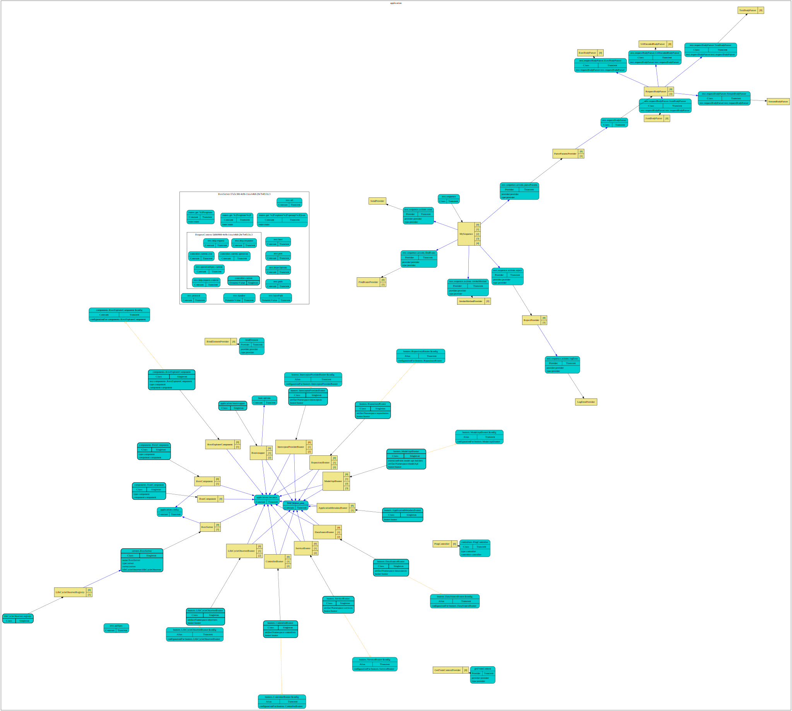

# loopback4-example-inspect

This example demonstrates the inspection of LoopBack 4 application context hierarchy.

The [PingController](https://github.com/raymondfeng/loopback4-example-inspect/blob/master/src/controllers/ping.controller.ts#L73-L85) now exposes the `/inspect` and `/graph` endpoint.

## Try out

```sh
npm i
npm start
```

### Endpoints

1. http://localhost:3000/inspect: Fetch a JSON document for the context hierarchy.

   The following query parameters are supported:

   - includeParent: include parent contexts (default: true)
   - includeInjections: include injections (default: true)
   - includeGraph: include a graph in [graphviz](https://www.graphviz.org/) dot format (default: true)

2. http://localhost:3000/graph: Render the LoopBack application as a SVG diagram.

   The following query parameters are supported:

   - includeParent: include parent contexts (default: true)
   - includeInjections: include injections (default: true)
   - format: dot or svg (default: svg)

3. http://localhost:3000/graph-d3: Display the graph using [d3-graphviz](https://github.com/magjac/d3-graphviz).

### Sample graph



## Test

```sh
npm test
```

[-@2x.png>)](http://loopback.io/)
